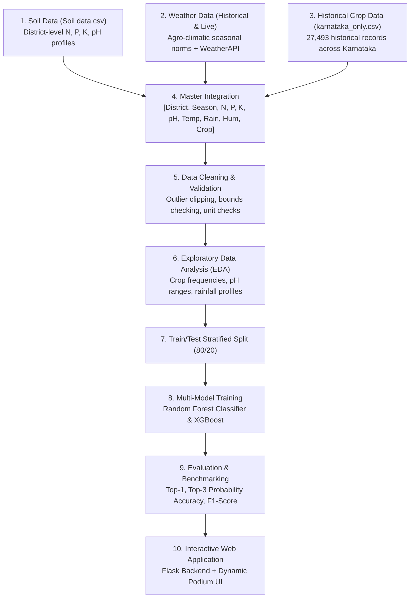

# AgriShift: AI Market-Aware Crop Optimization & Yield Forecasting System 

An intelligent, agro-climatic crop recommendation system tailored for Karnataka farmers and agricultural stakeholders. The system evaluates soil health ($N, P, K, \text{pH}$), historical seasonal patterns, and real-time weather data to recommend the **Top 3 Best Compatible Crops** with probability match meters, expected yield benchmarks, and actionable agronomic advice.

---

## 🌾 System Architecture & 10-Step Workflow



---

## 📊 Dataset Overview

| Dataset Source | Records / Coverage | Key Attributes |
| :--- | :--- | :--- |
| **`Soil data.csv`** | 875 samples, 101 districts | Nitrogen ($N$), Phosphorus ($P$), Potassium ($K$), Soil $\text{pH}$ |
| **`karnataka_only.csv`** | 27,493 records (1997–2020) | District, Season, Crop, Production, Area, Yield (Tonnes/Ha) |
| **WeatherAPI.com** | Live real-time & seasonal norms | Live Temperature (°C), Humidity (%), Precipitation (mm) |

---

## 🚀 How to Run the Application

### 1. Requirements
Ensure Python is installed along with the dependencies:
```bash
pip install flask flask-cors scikit-learn pandas numpy xgboost joblib
```

### 2. (Optional) Re-run Data Preprocessing & Model Training
To regenerate the master dataset and re-train the models:
```bash
python prepare_master_dataset.py
python train_crop_model.py
```

### 3. Launch the Web Application
```bash
python app.py
```
Open your browser and navigate to:
```
http://127.0.0.1:5000
```

---

## 🎯 Key Features

1. **Top 3 Ranked Recommendations**:
   - 🥇 **#1 Primary Crop**: Highest compatibility score with expected yield in Tonnes/Hectare.
   - 🥈 **#2 Alternative Crop**: Viable backup option with comparative advantages.
   - 🥉 **#3 Alternative Crop**: Diversification option for crop rotation or risk mitigation.
2. **Auto-Fill from District Soil & Weather**:
   - Selecting a Karnataka district automatically fetches live weather (via WeatherAPI) and pre-populates typical local soil nutrient levels.
3. **Manual Customization**:
   - Interactive sliders allow farmers to input exact laboratory soil test results ($N, P, K, \text{pH}$).
4. **Fertilizer & Soil Conditioning Tips**:
   - Provides targeted guidance on nutrient deficiencies (e.g., lime for acidic soils, urea top-dressing for low nitrogen).
